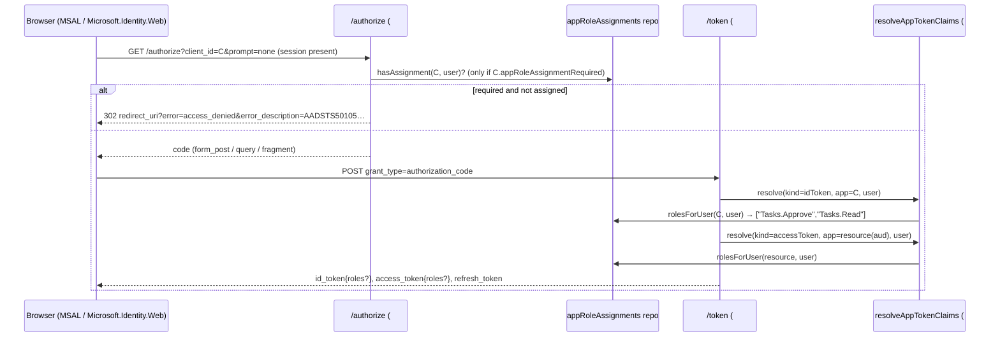

# Feature #xx — App role assignments (users and groups), `roles` in ID / delegated tokens, "assignment required"

- **Roadmap ref:** Not on the roadmap. Extends Iteration 1 feature #8 (app-only `roles`) and the token-configuration work (issue #15, migration 002) to **delegated** tokens. Related upstream discussion: issue #30 / PR #31 (auto-granted `roles` on delegated access tokens).
- **Dependencies:** [#2](2026-06-22_02-sqlite-store-schema-seed.md) (`app_registrations`, `app_roles`, `users`, `groups`, `group_members`, migrations, seed), [#5](2026-06-22_05-token-service.md) (claim tables, token-response builder), [#6](2026-06-22_06-auth-code-pkce-signin.md) (authorize, canonical OAuth error convention), [#7](2026-06-22_07-refresh-token.md) (refresh grant), [#8](2026-06-22_08-client-credentials.md) (app-only auto-grant model, unchanged), [#10](2026-06-22_10-minimal-graph.md) (Graph envelope), [#11](2026-06-22_11-admin-rest-api.md) (admin error convention), [#12](2026-06-22_12-web-portal.md) (app detail sections), token configuration — issue #15 (`resolveAppTokenClaims`, token preview, `docs/token-configuration.md`), [feature #15 device code](2026-06-24_15-device-code-flow.md).
- **Status:** ✅ Implemented (fork `VanGoghSoftware/entra-local`, branch `feature/app-role-assignments`). The `xx` in this file name is the upstream issue number, assigned when the issue is opened.

> **Canonical-reference notice.** This spec owns **app-role assignment** (who holds which app role) and the **`roles` claim on user tokens** (ID token and delegated access token). It does **not** change the app-only auto-grant model owned by [#8](2026-06-22_08-client-credentials.md). It supersedes the "delegated tokens carry no `roles`" row of [#5](2026-06-22_05-token-service.md)'s claim table.

---

## Goal / outcome

A developer can give **one local user one role and another user a different role** on an app, sign both in, and see the difference in the `roles` claim of the ID token and of the delegated access token — exactly what a server-side web app (`RequireRole(...)` in Microsoft.Identity.Web) or a resource API authorising on `roles` needs in order to be tested locally. A user without an assignment gets **no `roles` claim**, as in Entra. Optionally, an app can require assignment, in which case an unassigned user is **refused at sign-in** with Entra's `AADSTS50105` shape.

Measured against the current image (2026-09-12): no configuration puts `roles` into an ID token — defining `User`-type roles does nothing, `optionalClaims.idToken: [{"name":"roles"}]` is accepted and silently ignored, and only client-credentials tokens carry `roles`.

---

## Scope

### In scope
- **Store:** `app_role_assignments` table; `app_registrations.app_role_assignment_required` column; forward-only migration 003; repository; reset and seed.
- **Claims:** `roles` on the **ID token** (from the **client** app's assignments) and on the **delegated access token** (from the **resource** app's assignments), resolved in the shared claim resolver so the admin token preview matches issuance.
- **Assignment required:** per-app switch; refusal in `/authorize` (interactive and `prompt=none`), in the `authorization_code` and `refresh_token` grants, and in device-code approval.
- **Admin REST API:** list / create / delete assignments per app; read-only assignment lists per user and per group; the switch on app create/patch; assignment fields in the app DTO.
- **Portal:** a "Users and groups" section on the app detail page.
- **Graph (read-only):** `appRoleAssignments` on `/me`, `/users/{id}`, `/groups/{id}`; `appRoleAssignedTo` on `/servicePrincipals/{id}`. Delivered as a **separate commit** so it can be dropped if the maintainer keeps Graph app-role surfaces out of scope (roadmap "Broader Graph … app roles").
- **Seed:** two `User`-type roles on the existing `local-web-client` sample, one assigned to Alice directly and one to the `Developers` group.
- Docs: `docs/token-configuration.md`, README "what it emulates", `specs/roadmap.md` row, `memory/decisions.md` entry.

### Out of scope
- Assigning app roles to **applications** (service principals). App-only tokens keep [#8](2026-06-22_08-client-credentials.md)'s auto-grant: every enabled `Application`-type role of the resource, `[]` when none. Changing that would break every existing client-credentials user of the emulator.
- Consent, directory roles, mapping `groups` onto roles, Graph **writes** for assignments, SAML.
- Nested groups (the emulator has flat groups).

---

## Contracts

### Data model (migration 003 — `migration-003-app-role-assignments.ts`)

```sql
CREATE TABLE app_role_assignments (
  id         TEXT PRIMARY KEY,
  app_id     TEXT NOT NULL REFERENCES app_registrations(app_id) ON DELETE CASCADE,
  role_id    TEXT NOT NULL REFERENCES app_roles(id) ON DELETE CASCADE,
  user_id    TEXT REFERENCES users(id)  ON DELETE CASCADE,
  group_id   TEXT REFERENCES groups(id) ON DELETE CASCADE,
  created_at INTEGER NOT NULL,
  CHECK ((user_id IS NULL) <> (group_id IS NULL)),
  UNIQUE (role_id, user_id),
  UNIQUE (role_id, group_id)
);
CREATE INDEX idx_app_role_assignments_user  ON app_role_assignments(user_id);
CREATE INDEX idx_app_role_assignments_group ON app_role_assignments(group_id);

ALTER TABLE app_registrations ADD COLUMN app_role_assignment_required INTEGER NOT NULL DEFAULT 0;
```

- `app_id` is the app that **defines** the role (the resource), denormalised from `app_roles.app_id` so per-app queries need no join and the cascade is explicit.
- Two nullable principal columns instead of `(principal_type, principal_id)` so SQLite can cascade the delete of a user or a group; the DTO exposes `principalType` / `principalId` derived from whichever column is set.
- Forward-only, nullable/defaulted: existing databases need no data migration (same rule as migration 002). `reset` truncates the new table; `seed` is idempotent (`INSERT OR IGNORE`).

### Repository — `src/store/repositories/appRoleAssignments.ts`

```ts
interface AppRoleAssignment {
  id: string; appId: string; roleId: string;
  principalType: 'User' | 'Group'; principalId: string; createdAt: number;
}
interface AppRoleAssignmentsRepository {
  listForApp(appId: string): AppRoleAssignment[];
  listForUser(userId: string): AppRoleAssignment[];    // direct assignments only
  listForGroup(groupId: string): AppRoleAssignment[];
  getById(id: string): AppRoleAssignment | undefined;
  create(input: { appId; roleId; principalType; principalId }): AppRoleAssignment;
  remove(appId: string, id: string): boolean;
  /** Enabled `User`-type role values of `appId` held by `userId`, directly or through group membership. Distinct, sorted by value. */
  rolesForUser(appId: string, userId: string): string[];
  /** True when the user holds at least one assignment on `appId` (any role, enabled or not, direct or via group). */
  hasAssignment(appId: string, userId: string): boolean;
}
```

Wired into `Repositories` as `store.appRoleAssignments`. `rolesForUser` is the one query the claims depend on:

```sql
SELECT DISTINCT r.value
FROM app_role_assignments a
JOIN app_roles r ON r.id = a.role_id
WHERE a.app_id = ?
  AND r.is_enabled = 1
  AND (',' || REPLACE(r.allowed_member_types, ' ', '') || ',') LIKE '%,User,%'
  AND (a.user_id = ? OR a.group_id IN (SELECT group_id FROM group_members WHERE user_id = ?))
ORDER BY r.value;
```

### Claim rules

| Token | `roles` = | Source app | When empty |
|---|---|---|---|
| ID token | `rolesForUser(clientApp, user)` | the **client** app (`params.app`) | claim **omitted** |
| Delegated access token | `rolesForUser(resourceApp, user)` | the **resource** app resolved from `aud` (the same `store.apps.getByAppId(audience)` the token-configuration step already uses); Graph or an unregistered audience → no roles | claim **omitted** |
| App-only access token | unchanged ([#8](2026-06-22_08-client-credentials.md) auto-grant) | resource app | `[]` (unchanged) |

Resolution is a third step in `resolveAppTokenClaims` (`src/tokens/tokenConfig.ts`), beside optional claims and group claims, returned in `claims` as `roles: string[]` only when non-empty. Both call sites — `createTokenResponseBuilder` in `src/tokens/response.ts` and `tokenService.previewToken` — therefore agree by construction; the admin **token preview** and **token generate** endpoints show `roles` with no further change. The refresh grant re-mints through the same builder, so a revoked assignment disappears at the next refresh; the device-code grant likewise.

`roles` joins the supported optional-claim names only in documentation: it is emitted by assignment, not by listing it under `optionalClaims`. Listing it there stays a no-op (no longer silently — the existing "unsupported claim" warning names it and points at assignments).

### "Assignment required"

`appRoleAssignmentRequired` (boolean, default `false`) on the app registration. When `true` on the **client** app and `hasAssignment(clientApp, user)` is `false`:

| Where | Response |
|---|---|
| `/authorize`, interactive account picker submission | `302` to `redirect_uri` with `error=access_denied`, `error_description` below, `state` echoed (canonical redirect-error convention of [#6](2026-06-22_06-auth-code-pkce-signin.md)) |
| `/authorize` with `prompt=none` and a session | same `access_denied` redirect (a silent request never renders HTML) |
| `grant_type=authorization_code` (assignment removed between code issue and redemption) | `400 invalid_grant`, `error_codes: [50105]` |
| `grant_type=refresh_token` | `400 invalid_grant`, `error_codes: [50105]` |
| Device-code approval page, on account selection | the device code is **denied** (`store.deviceCodes.deny`), the page shows the message; the polling client receives the existing `access_denied` |

`error_description`: `AADSTS50105: Your administrator has configured the application <displayName> ('<appId>') to block users unless they are specifically granted ('assigned') access to the application. The signed in user is blocked because they are not a direct member of a group with access, nor had access directly assigned by an administrator.` — the numeric code is added to `oauthErrors.ts` as an override on `access_denied` / `invalid_grant` (`errorCodes: [50105]`), leaving the existing defaults untouched.

When `false` (default, and for every existing registration): behaviour is exactly today's — everybody signs in; `roles` is present only for the assigned.

### Admin REST API ([#11](2026-06-22_11-admin-rest-api.md) conventions: Zod validation, `AdminError` codes, camelCase DTOs)

| Route | Body / result | Errors |
|---|---|---|
| `GET /admin/api/apps/:id/roleAssignments` | `AppRoleAssignmentDto[]` (the app's assignments, newest first) | `404 not_found` unknown app |
| `POST /admin/api/apps/:id/roleAssignments` | body `{ roleId, principalType: 'User' \| 'Group', principalId }` → `201 AppRoleAssignmentDto` | `404` unknown app; `400 invalid_reference` unknown role (or a role of another app) / unknown user / unknown group; `400 validation_error` (target `roleId`) when the role's `allowedMemberTypes` lacks `User`; `409 conflict` duplicate |
| `DELETE /admin/api/apps/:id/roleAssignments/:subId` | `204` | `404` unknown app or assignment |
| `GET /admin/api/users/:id/appRoleAssignments` | `AppRoleAssignmentDto[]` — **direct** assignments of the user | `404` unknown user |
| `GET /admin/api/groups/:id/appRoleAssignments` | `AppRoleAssignmentDto[]` | `404` unknown group |
| `POST /admin/api/apps`, `PATCH /admin/api/apps/:id` | accept `appRoleAssignmentRequired?: boolean` (create default `false`) | as today |

```ts
interface AppRoleAssignmentDto {
  id: string;
  appId: string;                 // resource (role-defining) app
  roleId: string;
  roleValue: string;             // convenience for tables and tests
  principalType: 'User' | 'Group';
  principalId: string;
  principalDisplayName: string;  // user displayName or group displayName
  createdAt: string;             // ISO 8601, via isoFromEpoch
}
```

The app DTO gains `appRoleAssignmentRequired: boolean`. Assignments are **not** embedded in the app DTO (a group assignment can fan out to many users; the list is fetched separately). Disabling a role keeps its assignments but removes it from `rolesForUser`; deleting a role, user, group or app cascades.

### Graph (read-only; separate commit) — [#10](2026-06-22_10-minimal-graph.md) envelope, bearer token required as for `/users`

| Route | Semantics |
|---|---|
| `GET /v1.0/me/appRoleAssignments` | delegated token only; the caller's **direct** assignments |
| `GET /v1.0/users/{id}/appRoleAssignments` | the user's **direct** assignments (Graph parity: group-inherited ones are not listed here) |
| `GET /v1.0/groups/{id}/appRoleAssignments` | the group's assignments |
| `GET /v1.0/servicePrincipals/{id}/appRoleAssignedTo` | every principal assigned to the resource app; `{id}` is the app's `appId` |

Graph resource shape (`microsoft.graph.appRoleAssignment`):

```jsonc
{
  "id": "…",
  "appRoleId": "<app_roles.id>",
  "createdDateTime": "2026-09-13T10:00:00Z",
  "deletedDateTime": null,
  "principalDisplayName": "Alice Example",
  "principalId": "aaaaaaaa-0000-0000-0000-000000000001",
  "principalType": "User",                       // or "Group"
  "resourceDisplayName": "local-web-client",
  "resourceId": "cccccccc-0000-0000-0000-000000000006"   // divergence: the appId, there is no service principal
}
```

Collections use `@odata.context` (`$metadata#users('<id>')/appRoleAssignments` etc.), `value[]`, and the existing `$top`/`$skip` paging. **Documented divergence:** Entra's `resourceId` is the service-principal object id; the emulator has no service principals, so it is the resource app's `appId`, and `/servicePrincipals/{id}` accepts that `appId`.

### Portal ([#12](2026-06-22_12-web-portal.md); `DESIGN.md` status is *defined*, follow it)

App detail page, new section `{ id: 'assignments', label: 'Users and groups' }` inserted after **App roles**:

- **Assignment required** toggle (writes `PATCH …/apps/:id` `appRoleAssignmentRequired`), with one line of help text: *"When on, users without an assignment are refused at sign-in (AADSTS50105)."*
- **Table** of assignments: principal (display name + `IdChip`), type, role value, created, row overflow menu with *Remove*.
- **Add assignment** dialog: principal type (User / Group), principal (searchable select over `/admin/api/users` or `/admin/api/groups`), role (enabled roles of this app whose `allowedMemberTypes` includes `User`; the dialog says so when there is none and links to the App roles section). Submits `POST …/roleAssignments`; `409` and `400` surface inline.
- Empty state: *"No users or groups are assigned. Sign-ins succeed without a `roles` claim."*

API client additions in `portal/src/api/client.ts` + types; tests in `portal/src/routes/AppDetail.test.tsx` with the msw server in `portal/src/test/server.ts` (tab switch, table render, add, remove, toggle).

### Seed additions (`src/store/seed.ts`, all `INSERT OR IGNORE`, fixed ids)

| Item | Value |
|---|---|
| Roles on `local-web-client` (`cccccccc-…-0006`) | `Tasks.Read` (`eeeeeeee-0000-0000-0000-000000000002`) and `Tasks.Approve` (`…-0003`), `allowedMemberTypes: User`, enabled |
| Assignment | Alice → `Tasks.Approve` (direct), id `abababab-0000-0000-0000-000000000001` |
| Assignment | group `Developers` (`bbbbbbbb-…-0002`, members Alice and Bob) → `Tasks.Read`, id `…-0002` |
| Result | Alice's ID token from `local-web-client`: `roles: ["Tasks.Approve","Tasks.Read"]`; Bob's: `roles: ["Tasks.Read"]`; every other seeded app unchanged; `appRoleAssignmentRequired` off everywhere |

If an existing integration test asserts the *exact* ID-token claim set of `local-web-client`, the assertion is extended rather than the seed moved — the sample is meant to demonstrate token configuration, and roles belong in that demonstration.

---

## Behavior / flow



### Validation rules
1. `POST …/roleAssignments`: app exists → role exists **and** `role.appId === app.appId` → role's `allowedMemberTypes` includes `User` → principal exists (user or group per `principalType`) → not a duplicate → insert.
2. `rolesForUser` only counts **enabled** roles with `User` in `allowedMemberTypes`; `hasAssignment` counts **any** assignment (Entra refuses on "no assignment", not on "no enabled role").
3. Assignment-required is evaluated against the **client** app in `/authorize`, the `authorization_code` grant and the `refresh_token` grant, and against the device-code app in approval. Never against the resource app.
4. Claims: `roles` is emitted only when non-empty; order is `ORDER BY value`; duplicates from overlapping direct + group assignments collapse (`DISTINCT`).

---

## Acceptance criteria / tests

**Unit (`test/unit`)**
- `store-repositories.test.ts`: create / list / remove; unique constraints (`409` surface); cascade on role, user, group, app delete; `rolesForUser` with direct, group, overlapping, disabled-role, and `Application`-only-role cases; `hasAssignment` ignores enablement.
- `tokens-token-config.test.ts`: `resolveAppTokenClaims` returns `roles` for `idToken` (client app) and `accessToken` (resource app), omits it when empty, and the preview equals issuance for the same inputs.

**Integration (`test/integration`)**
- `auth-code.test.ts`: Alice's ID token from `local-web-client` carries `["Tasks.Approve","Tasks.Read"]`, Bob's `["Tasks.Read"]`; a user with no assignment has **no** `roles` key; the delegated access token for `local-api` carries the roles assigned there and none when the audience is Graph.
- `refresh-token.test.ts`: after `DELETE` of an assignment, the refreshed tokens drop the role.
- `auth-code.test.ts` (assignment required): with `appRoleAssignmentRequired: true` — unassigned user, interactive → `302 … error=access_denied` + `AADSTS50105`; `prompt=none` → same; assigned user → code. `authorization_code` redemption after the assignment is removed → `400 invalid_grant` `error_codes: [50105]`.
- `device-code.test.ts`: approval by an unassigned user on a required app → poll returns `access_denied`.
- `admin-api.test.ts`: the six routes above, every error row in the admin table, DTO shape, `appRoleAssignmentRequired` on create/patch and in the app DTO; token-preview for Alice on `local-web-client` shows `roles`.
- `graph.test.ts`: the four Graph routes, envelope, `resourceId` = `appId`, `/me/appRoleAssignments` rejects an app-only token, `/users/{id}` lists direct only.
- `store.test.ts`: migration 003 applies on top of a 002 database with existing registrations; `reset` empties the new table; `seed` is idempotent.

**Portal (`portal/src/routes/AppDetail.test.tsx`)**: the section appears after App roles; table renders msw data; add dialog posts and refreshes; remove deletes; toggle patches; empty state text.

**Quality gates (CONTRIBUTING):** `pnpm lint`, `pnpm typecheck`, `pnpm test` green; the Docker run-target job still passes (no config change).

---

## Compatibility and divergences

- **Existing users:** no behaviour change until an assignment is created or the switch is turned on. App-only tokens are untouched. Migration is additive.
- **Issue #30 / PR #31:** #31 auto-grants every enabled `User`-type role of the resource to every user in delegated access tokens. This spec derives `roles` from assignments instead and also covers the ID token. If #31 lands first, its `rolesForMemberType('User')` call sites in `response.ts` are replaced by `rolesForUser`; the helper itself stays for the `Application` case. An "auto-grant when the app has no assignments" fallback is **deliberately not** proposed: it would be a hidden mode whose output changes the moment the first assignment is made.
- **Divergences from Entra, documented in `docs/token-configuration.md`:** `resourceId` is the `appId` (no service principals); `/users/{id}/appRoleAssignments` is direct-only as in Graph, while the token reflects group-inherited roles as in Entra; assignment is never required for app-only tokens (auto-grant); no nested groups; `AADSTS50105` is returned as an OAuth redirect error rather than Entra's interactive error page, so headless clients and `prompt=none` callers see it in-band.

---

## Open questions for the maintainer

1. Is the read-only Graph surface acceptable, given the roadmap lists "Broader Graph … app roles" as deferred? It is a separate commit and can be dropped.
2. Should assignment-required also gate the **device-code** flow (proposed: yes, via `deny`), or only browser sign-in?
3. Naming: `roleAssignments` on the admin API mirrors the portal's language; Graph uses `appRoleAssignments` / `appRoleAssignedTo`. Keep both, or align the admin API on Graph's names?

---

## Implementation notes (files)

| Layer | Files |
|---|---|
| Store | `src/store/migrations/migration-003-app-role-assignments.ts`, registered wherever migration 002 is, `src/store/repositories/appRoleAssignments.ts`, `repositories/index.ts`, `repositories/apps.ts` (new column), `src/store/types.ts`, `src/store/reset.ts`, `src/store/seed.ts` |
| Tokens | `src/tokens/tokenConfig.ts` (roles step), `src/tokens/claims.ts` (`roles?` on `IdTokenClaims`), `docs/token-configuration.md` |
| Identity | `src/identity/authorize.ts` (required check before `issueCodeAndRedirect`, both paths), `src/identity/token.ts` (`authorization_code`, `refresh_token`), `src/identity/deviceApproval.ts`, `src/identity/oauthErrors.ts` (50105) |
| Admin | `src/admin/routes.apps.ts`, `routes.users.ts`, `routes.groups.ts`, `schemas.ts`, `dto.ts` |
| Graph | `src/graph/handlers.ts` (+ route registration where `/users/:id/memberOf` is registered) |
| Portal | `portal/src/routes/AppDetail.tsx`, `portal/src/api/client.ts`, `portal/src/api/types.ts`, `portal/src/routes/AppDetail.test.tsx`, `portal/src/test/server.ts` |
| Docs | this spec, `specs/roadmap.md`, `README.md`, `memory/decisions.md` |
